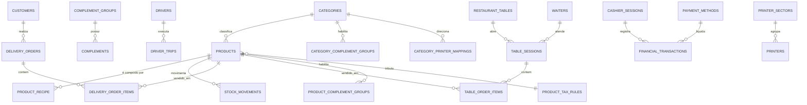

# Mapa de telas e tabelas — Painel Marca O Lanches

> **Base analisada:** repositório `painel-marcaolanches-6f55794c`, branch padrão, commit `9964016`.
>
> Este documento é um inventário técnico das telas que o projeto já expõe e das entidades Supabase relacionadas. As tabelas foram identificadas por chamadas `supabase.from(...)`, componentes e tipagem `src/integrations/supabase/types.ts`. Uma tela pode carregar dados de forma indireta por componentes filhos; nesses casos, a relação está indicada.

## Rotas da aplicação

| Rota | Tela | Finalidade | Principais fontes de dados |
|---|---|---|---|
| `/` | Cardápio/pedido digital | Vitrine de produtos e fluxo de pedido delivery | `store_settings`, `categories`, `products`, complementos, `customers`, `delivery_orders`, `delivery_order_items`, `delivery_areas`, `payment_methods` |
| `/login` | Login | Autenticação de equipe, motoboy ou garçom | `profiles`, `drivers`, `waiters` |
| `/admin` | Painel administrativo | Todas as telas abaixo, controladas por abas | Conforme módulo |
| `/preview-impressao` | Prévia de impressão | Pré-visualização de documentos/comandas | Dados recebidos pela navegação; recursos de impressão |

## Painel administrativo: telas, objetivo e tabelas

### Dashboard e atendimento

| Aba / tela | O que permite fazer | Tabelas e views utilizadas |
|---|---|---|
| **Dashboard** (`dashboard`) | Indicadores de pedidos, vendas, caixa e acesso rápido às rotinas operacionais. | `delivery_orders`, `delivery_order_items`, `table_sessions`, `table_order_items`, `financial_transactions`, `cashier_sessions`, `products`, `store_settings` |
| **Engenharia de Cardápio** (`engenharia_cardapio`) | Analisa custos, margem, preço e fichas técnicas dos produtos. | `products`, `product_recipe` |
| **Atendimento / PDV** (`delivery_module`) | Cria e edita pedidos delivery/balcão, seleciona cliente, itens, complementos, entrega, pagamento e impressão. | `delivery_orders`, `delivery_order_items`, `customers`, `products`, `categories`, `complement_groups`, `complements`, `product_complement_groups`, `category_complement_groups`, `delivery_areas`, `drivers`, `payment_methods`, `financial_transactions`, `cashier_sessions`, `printers`, `printing_jobs`, `store_settings` |
| **Mesas – visão rápida** (`tables_quick_view`) | Exibe situação das mesas e sessões abertas; abre a comanda. | `restaurant_tables`, `table_sessions`, `table_order_items`, `cashier_sessions`, `store_settings` |
| **Gestão de Mesas** (`tables_module`) | Cadastra mesas/setores/QR Code e acompanha sessões. | `restaurant_tables`, `table_sessions`, `cashier_sessions`, `store_settings` |
| **Garçons** (`waiters_module`) | Cadastro, edição e ativação de garçons. | `waiters` |
| **Produção (KDS)** (`kitchen_dashboard`) | Fila de produção de itens de mesas e delivery; mudança de status. | `table_order_items`, `table_sessions`, `delivery_order_items`, `delivery_orders`, `store_settings`, `products` |
| **Pedidos** (`history_module`) | Histórico, filtros, detalhe, cancelamento/reimpressão de pedidos. | `delivery_orders`, `delivery_order_items`, `customers`, `drivers`, `products`, `payment_methods`, `financial_transactions`, `fiscal_documents`, `printers`, `printing_jobs` |
| **Entregas em Andamento** (`live_deliveries`) | Monitora pedidos despachados e responsável pela entrega. | `delivery_orders`, `profiles` *(e dados de entregador associados ao pedido)* |
| **Caixa** (`cashier`) | Abertura/fechamento, entradas/saídas, conferência e resumo financeiro. | `cashier_sessions`, `financial_transactions`, `financial_categories`, `payment_methods`, `delivery_orders`, `table_sessions`, `customer_ledgers`, `chart_of_accounts` |
| **Comandas** *(componente operacional)* | Consulta e gestão de comandas/status. | `comandas`, `v_comandas_status` *(view)* |
| **Relatórios de mesas / gamificação** *(componentes)* | Métricas de vendas, sessões, desempenho. | `table_sessions`, `table_order_items`, `cashier_sessions`, `store_settings` |

### Cadastros, cardápio e estoque

| Aba / tela | O que permite fazer | Tabelas e views utilizadas |
|---|---|---|
| **Empresa** (`company`) | Dados da loja, horários, entrega, configuração visual e fiscal. | `store_settings` |
| **Cardápio / Produtos** (`products`) | Cadastro de produtos, preço, disponibilidade, estoque, imagem, impostos, complementos e ficha técnica. | `products`, `categories`, `product_recipe`, `stock_movements`, `product_complement_groups`, `complement_groups`, `complements`, `product_tax_rules`, `suppliers` |
| **Categorias** (`categories`) | Cadastro, ordenação e imagem das categorias; vínculo com complementos e impressão. | `categories`, `category_complement_groups`, `complement_groups`, `category_printer_mappings`, `printer_sectors` |
| **Complementos** (`complements_admin`) | Grupos, opções e vínculo a categoria/produto. | `complement_groups`, `complements`, `category_complement_groups`, `product_complement_groups`, `categories`, `products` |
| **Insumos** (`insumos`) | Cadastro de ingredientes/insumos e seus usos em fichas técnicas. | `products` *(itens tipo insumo)*, `categories`, `product_recipe` |
| **Estoque** (`estoque`) | Saldo atual, entrada/saída/ajuste e histórico de movimentações. | `products`, `stock_movements`, `product_recipe` |
| **Ficha Técnica** *(subtela do produto)* | Define insumos e quantidades consumidas em um produto. | `products`, `product_recipe` |
| **Clientes** (`customers_tab`) | Cadastro, endereços/contatos, histórico e conta corrente. | `customers`, `customer_ledgers`, `delivery_orders`, `financial_transactions` |
| **Usuários** (`users`) | Usuários internos, função e permissões por módulo/campo. | `profiles` |
| **Motoqueiros** (`drivers`) | Cadastro de entregadores e acompanhamento de viagens. | `drivers`, `driver_trips`, `delivery_orders` |
| **Fornecedores** (`suppliers_tab`) | Cadastro e manutenção de fornecedores. | `suppliers` |
| **Áreas de Ação** (`delivery_zones`) | Polígonos/faixas, taxa e prazo de entrega. | `delivery_areas`, `store_settings` |

### Financeiro

| Aba / tela | O que permite fazer | Tabelas e views utilizadas |
|---|---|---|
| **Financeiro** (`finance`) | Fluxo financeiro, lançamentos, categorias e contas. | `financial_transactions`, `financial_categories`, `chart_of_accounts`, `cashier_sessions`, `payment_methods`, `customers`, `suppliers` |
| **Contas a Receber** (`receivables`) | Filtra e baixa lançamentos de receita pendentes. | `financial_transactions`, `financial_categories`, `customers`, `payment_methods` |
| **Contas a Pagar** (`payables`) | Filtra e baixa despesas/obrigações pendentes. | `financial_transactions`, `financial_categories`, `suppliers`, `payment_methods` |
| **Forma de Pagamento** (`payment_methods_tab`) | Configura meios de pagamento e comportamento no caixa. | `payment_methods` |

### Fiscal

| Aba / tela | O que permite fazer | Tabelas e views utilizadas |
|---|---|---|
| **Perfis Tributários** (`tax_rules`) | Regra fiscal vinculável ao produto. | `product_tax_rules`, `products` |
| **Tipo de Nota** (`note_type`) | Parâmetros e tipo de emissão fiscal. | `fiscal_note_config`, `store_settings` |
| **Classificação IBS/CBS** (`cclass_trib`) | Mantém códigos/classificações tributárias. | `fiscal_cclass_trib` |
| **Auditoria Fiscal** (`fiscal_audit`) | Verifica cadastro de produtos/categorias e pendências tributárias. | `products`, `categories`, `product_tax_rules` |
| **Documentos Fiscais** (`fiscal_documents`) | Lista, consulta e pré-visualiza documentos emitidos. | `fiscal_documents`, `delivery_orders`, `table_sessions`, `customers`, `fiscal_logs` |
| **Logs Fiscais** (`fiscal_logs`) | Eventos, erros e rastreabilidade das integrações. | `fiscal_logs`, `fiscal_logs_view` *(view)*, `fiscal_error_logs` |
| **Endpoints API** (`api_endpoints`) | Configuração de URLs/rotas para emissão fiscal. | `fiscal_api_endpoints` e/ou `fiscal_endpoints` |

### Marketing, impressão e comunicação

| Aba / tela | O que permite fazer | Tabelas e views utilizadas |
|---|---|---|
| **Campanhas Semanais** (`weekly_campaigns`) | Banners/campanhas, período de exibição e métricas de acesso. | `weekly_campaigns`; há referência legada a `campaigns` |
| **Impressoras** (`printer_config`) | Setores, impressoras, vínculo de categorias e fila de impressão. | `printer_sectors`, `printers`, `category_printer_mappings`, `printing_jobs`, `categories`, `store_settings` |
| **WhatsApp Bot** (`whatsapp_bot`) | Configuração do canal e mensagens automatizadas. | `store_settings`, `whatsapp_bot_messages`; infraestrutura também contém `whatsapp_conversations` e `whatsapp_messages` |

## Relações de negócio mais importantes

## Catálogo técnico do banco

A seguir estão os campos `Row` e as chaves estrangeiras presentes no arquivo de tipos Supabase do projeto. Campos que aceitam `null` são opcionais no banco. O catálogo é especialmente útil para montar formulários, listagens e filtros sem adivinhar os nomes das colunas.

### `app_version`

**Campos:** `active` (boolean), `created_at` (string), `id` (number), `release_date` (string), `version` (string).

### `cashier_sessions`

**Campos:** `closed_at` (string | null), `closing_balance` (number | null), `created_at` (string), `created_by` (string | null), `id` (string), `notes` (string | null), `opened_at` (string), `opening_balance` (number), `status` (string), `updated_at` (string).

**Relações:** `created_by` → `profiles.id`.

### `categories`

**Campos:** `created_at` (string | null), `id` (string), `image_url` (string | null), `name` (string), `order` (number | null).

### `category_complement_groups`

**Campos:** `category_id` (string), `created_at` (string), `group_id` (string).

**Relações:** `category_id` → `categories.id`; `group_id` → `complement_groups.id`.

### `category_printer_mappings`

**Campos:** `category_id` (string), `id` (string), `sector_id` (string | null).

**Relações:** `sector_id` → `printer_sectors.id`.

### `chart_of_accounts`

**Campos:** `active` (boolean | null), `code` (string), `created_at` (string), `id` (string), `level` (number | null), `name` (string), `parent_id` (string | null), `type` (string | null), `updated_at` (string).

**Relações:** `parent_id` → `chart_of_accounts.id`.

### `complement_groups`

**Campos:** `created_at` (string), `description` (string | null), `id` (string), `max_choices` (number | null), `min_choices` (number | null), `name` (string), `updated_at` (string).

### `complements`

**Campos:** `created_at` (string), `group_id` (string | null), `id` (string), `is_active` (boolean | null), `name` (string), `price` (number | null), `size_prices` (Json | null), `updated_at` (string).

**Relações:** `group_id` → `complement_groups.id`.

### `customer_ledgers`

**Campos:** `amount` (number), `created_at` (string | null), `customer_id` (string | null), `description` (string | null), `id` (string), `order_id` (string | null), `type` (string).

**Relações:** `customer_id` → `customers.id`; `order_id` → `delivery_orders.id`.

### `customers`

**Campos:** `address` (string | null), `address_complement` (string | null), `address_number` (string | null), `allow_fiado` (boolean | null), `auth_user_id` (string | null), `city` (string | null), `cnpj` (string | null), `cpf` (string | null), `created_at` (string), `credit_limit` (number | null), `current_balance` (number | null), `email` (string | null), `id` (string), `name` (string), `neighborhood` (string | null), `password` (string | null), `person_type` (Database["public"]["Enums"]["person_type"] | null), `phone` (string | null), `state` (string | null), `updated_at` (string), `zip_code` (string | null).

### `delivery_areas`

**Campos:** `center_lat` (number | null), `center_lng` (number | null), `created_at` (string), `fee` (number), `id` (string), `is_active` (boolean | null), `name` (string), `polygon_coords` (Json | null), `radius_km` (number), `updated_at` (string).

### `delivery_order_items`

**Campos:** `created_at` (string), `id` (string), `notes` (string | null), `order_id` (string), `priority` (number | null), `product_id` (string | null), `product_name` (string), `production_status` (string | null), `quantity` (number), `selected_complements` (Json | null), `total_price` (number), `unit_price` (number), `updated_at` (string | null).

**Relações:** `order_id` → `delivery_orders.id`; `product_id` → `products.id`.

### `delivery_orders`

**Campos:** `cashier_session_id` (string | null), `created_at` (string), `customer_address` (string | null), `customer_cep` (string | null), `customer_city` (string | null), `customer_id` (string | null), `customer_name` (string | null), `customer_phone` (string | null), `customer_state` (string | null), `delivery_fee` (number | null), `driver_id` (string | null), `driver_location` (Json | null), `estimated_delivery_time` (string | null), `estimated_time` (number | null), `frete` (number), `id` (string), `is_on_account` (boolean | null), `motoqueiro_lat` (number | null), `motoqueiro_lng` (number | null), `neighborhood` (string | null), `notes` (string | null), `observation` (string | null), `order_type` (string), `payment_method` (string | null), `payment_split_details` (Json | null), `reconciled_at` (string | null), `status` (string), `tipo_venda` (string | null), `total_amount` (number), `tracking_status` (string | null), `updated_at` (string).

**Relações:** `cashier_session_id` → `cashier_sessions.id`; `customer_id` → `customers.id`; `driver_id` → `drivers.id`.

### `driver_trips`

**Campos:** `cashier_session_id` (string | null), `created_at` (string), `driver_id` (string), `fee_per_trip` (number), `id` (string), `notes` (string | null), `total_fee` (number), `trip_count` (number).

**Relações:** `cashier_session_id` → `cashier_sessions.id`; `driver_id` → `drivers.id`.

### `drivers`

**Campos:** `active` (boolean | null), `auth_user_id` (string | null), `created_at` (string | null), `daily_rate` (number), `fixed_fee` (number | null), `has_fixed_fee` (boolean | null), `id` (string), `is_active` (boolean | null), `login` (string | null), `name` (string), `password` (string | null), `phone` (string), `updated_at` (string | null).

### `financial_categories`

**Campos:** `chart_account_id` (string | null), `created_at` (string | null), `id` (string), `name` (string), `type` (string).

**Relações:** `chart_account_id` → `chart_of_accounts.id`.

### `financial_transactions`

**Campos:** `amount` (number), `cashier_session_id` (string | null), `category_id` (string | null), `chart_account_id` (string | null), `created_at` (string | null), `customer_id` (string | null), `date` (string), `description` (string), `due_date` (string | null), `id` (string), `payment_date` (string | null), `status` (string | null), `supplier_id` (string | null), `type` (string).

**Relações:** `cashier_session_id` → `cashier_sessions.id`; `category_id` → `financial_categories.id`; `chart_account_id` → `chart_of_accounts.id`; `customer_id` → `customers.id`; `supplier_id` → `suppliers.id`.

### `fiscal_api_endpoints`

**Campos:** `active` (boolean | null), `chave` (string), `created_at` (string | null), `id` (string), `label` (string), `method` (string), `url` (string).

### `fiscal_cclass_trib`

**Campos:** `aliquota_cbs` (number | null), `cclass_trib` (string | null), `created_at` (string), `cst` (string | null), `cst_ibs_cbs` (string | null), `descr_cclass_trib` (string | null), `id` (string), `ind_g_trib_regular` (boolean | null), `ind_nfce` (boolean | null), `ind_nfe` (boolean | null), `nome_cclass_trib` (string | null), `pred_cbs` (number | null), `pred_ibs` (number | null), `updated_at` (string).

### `fiscal_documents`

**Campos:** `ambiente` (number | null), `cancelado_em` (string | null), `chave_acesso` (string | null), `cliente_nome` (string | null), `codigo_status` (string | null), `created_at` (string | null), `danfe_url` (string | null), `emitido_em` (string | null), `id` (string), `id_nuvemfiscal` (string | null), `modelo` (number), `motivo_status` (string | null), `numero` (number), `pedido_id` (string), `protocolo` (string | null), `request_json` (Json | null), `response_json` (Json | null), `serie` (number), `status` (string), `tipo` (string), `updated_at` (string | null), `valor_cbs` (number | null), `valor_cofins` (number | null), `valor_ibs` (number | null), `valor_icms` (number | null), `valor_pis` (number | null), `valor_produtos` (number | null), `valor_total` (number | null), `xml_url` (string | null).

### `fiscal_endpoints`

**Campos:** `category` (string), `created_at` (string), `description` (string | null), `id` (string), `is_active` (boolean), `key` (string), `label` (string), `method` (string), `updated_at` (string), `url` (string).

### `fiscal_error_logs`

**Campos:** `created_at` (string), `diagnostics` (Json | null), `id` (string), `mensagem` (string | null), `pedido_id` (string | null), `raw` (string | null), `tipo` (string | null), `titulo` (string), `usuario_id` (string | null).

### `fiscal_logs`

**Campos:** `created_at` (string | null), `detalhes` (Json | null), `evento` (string), `fiscal_document_id` (string | null), `id` (string), `ip` (string | null), `mensagem` (string | null), `pedido_id` (string | null), `status` (string | null), `tipo` (string), `usuario_id` (string | null), `usuario_nome` (string | null).

### `fiscal_note_config`

**Campos:** `active` (boolean | null), `created_at` (string | null), `fin_nfe` (number), `id` (string), `id_dest` (number), `ind_final` (number), `ind_intermed` (number), `ind_pres` (number), `mod_nfce` (number), `mod_nfe` (number), `proc_emi` (number), `resp_tec_cnpj` (string | null), `resp_tec_contato` (string | null), `resp_tec_email` (string | null), `resp_tec_fone` (string | null), `scope_nfce` (string), `scope_nfe` (string), `tp_emis` (number), `tp_imp` (number), `tp_nf` (number), `ver_proc` (string), `versao` (string).

### `payment_methods`

**Campos:** `chart_account_id` (string | null), `created_at` (string | null), `icon` (string | null), `id` (string), `is_active` (boolean | null), `name` (string).

**Relações:** `chart_account_id` → `chart_of_accounts.id`.

### `print_jobs`

**Campos:** `content` (string), `created_at` (string | null), `error_message` (string | null), `id` (string), `printer_id` (string | null), `retry_count` (number | null), `sector_id` (string | null), `status` (string | null), `updated_at` (string | null).

**Relações:** `printer_id` → `printers.id`; `sector_id` → `printer_sectors.id`.

### `printer_sectors`

**Campos:** `created_at` (string | null), `description` (string | null), `id` (string), `name` (string), `updated_at` (string | null).

### `printers`

**Campos:** `auto_browser_print` (boolean | null), `auto_print` (boolean | null), `connection_type` (string | null), `copies` (number | null), `created_at` (string | null), `description` (string | null), `esc_pos_compatible` (boolean | null), `id` (string), `ip_address` (string | null), `is_active` (boolean | null), `model` (string | null), `name` (string), `port` (number | null), `priority` (number | null), `sector_id` (string | null), `show_preview` (boolean | null), `updated_at` (string | null).

**Relações:** `sector_id` → `printer_sectors.id`.

### `printing_jobs`

**Campos:** `content` (string), `created_at` (string | null), `error_message` (string | null), `id` (string), `printer_id` (string | null), `retry_count` (number | null), `status` (string | null), `updated_at` (string | null).

**Relações:** `printer_id` → `printers.id`.

### `product_complement_groups`

**Campos:** `created_at` (string), `group_id` (string), `id` (string), `product_id` (string), `updated_at` (string).

**Relações:** `group_id` → `complement_groups.id`; `product_id` → `products.id`.

### `product_recipe`

**Campos:** `created_at` (string), `id` (string), `ingredient_id` (string), `notes` (string | null), `product_id` (string), `quantity` (number), `unit` (string | null), `updated_at` (string), `variant_label` (string | null), `waste_percentage` (number).

**Relações:** `ingredient_id` → `products.id`; `product_id` → `products.id`.

### `product_tax_rules`

**Campos:** `active` (boolean), `aliq_cbs` (number), `aliq_cofins` (number), `aliq_ibsmun` (number), `aliq_ibsuf` (number), `aliq_icms` (number), `aliq_pis` (number), `aliquota_cbs` (number | null), `aliquota_ibs` (number | null), `cclass_trib` (string | null), `cfop` (string | null), `cfop_estadual` (string | null), `cfop_interestadual` (string | null), `created_at` (string), `cst` (string | null), `cst_cofins` (string), `cst_ibscbs` (string | null), `cst_icms_estadual` (string | null), `cst_icms_interestadual` (string | null), `cst_pis` (string), `descricao` (string | null), `id` (string), `nome` (string), `orig_icms` (number), `red_bc` (number), `updated_at` (string).

### `products`

**Campos:** `active` (boolean | null), `allow_crust` (boolean | null), `allow_half_half` (boolean | null), `allow_sell_without_stock` (boolean), `category_id` (string | null), `cest` (string | null), `control_inventory` (boolean), `cost_per_unit` (number | null), `created_at` (string | null), `cst` (string | null), `current_stock` (number), `description` (string | null), `desired_margin_percentage` (number | null), `discount_percent` (number | null), `discount_price` (number | null), `ean_code` (string | null), `energy_cost` (number), `id` (string), `image_url` (string | null), `is_available` (boolean | null), `is_pizza_flavor` (boolean | null), `is_promotional` (boolean | null), `labor_cost` (number), `loss_percentage` (number), `minimum_stock` (number), `name` (string), `ncm` (string | null), `packaging_cost` (number), `price` (number), `price_2` (number | null), `product_type` (string), `purchase_price` (number | null), `sell_delivery` (boolean | null), `sell_digital_menu` (boolean | null), `sell_dine_in` (boolean | null), `send_to_kds` (boolean | null), `send_to_production` (boolean | null), `size_prices` (Json | null), `suggested_products` (string[] | null), `supplier_code` (string | null), `supplier_name` (string | null), `tax_rule_id` (string | null), `tipo_produto` (string), `unidade` (string), `unit` (string | null), `yield_quantity` (number | null).

**Relações:** `category_id` → `categories.id`; `tax_rule_id` → `product_tax_rules.id`.

### `profiles`

**Campos:** `active` (boolean | null), `allowed_modules` (Json), `can_cancel` (boolean | null), `can_delete` (boolean | null), `created_at` (string | null), `email` (string), `full_name` (string | null), `id` (string), `is_kds_only` (boolean | null), `password` (string | null), `role` (string | null), `username` (string | null), `visible_fields` (Json).

### `restaurant_tables`

**Campos:** `created_at` (string), `id` (string), `number` (string), `prefix` (string | null), `qr_code_url` (string | null), `sector` (string | null), `updated_at` (string).

### `stock_movements`

**Campos:** `created_at` (string), `id` (string), `movement_type` (string), `notes` (string | null), `product_id` (string), `quantity` (number), `reason` (string | null), `reference_id` (string | null), `reference_type` (string | null), `unit_cost` (number | null).

**Relações:** `product_id` → `products.id`.

### `store_settings`

**Campos:** `access_token_nfce` (string | null), `access_token_nfe` (string | null), `access_token_nuvemf_cep` (string | null), `access_token_nuvemf_nfce` (string | null), `access_token_nuvemf_nfe` (string | null), `address` (string | null), `address_number` (string | null), `aliq_cbs` (number), `aliq_ibsmun` (number), `aliq_ibsuf` (number), `auto_manage_menu` (boolean | null), `centralized_printing` (boolean | null), `city` (string | null), `client_id` (string | null), `client_secret` (string | null), `cnpj` (string | null), `complement` (string | null), `couvert_artistico_enabled` (boolean | null), `couvert_artistico_value` (number | null), `cpf` (string | null), `created_at` (string | null), `default_driver_fee` (number | null), `delivery_enabled` (boolean | null), `digital_menu_url` (string | null), `email` (string | null), `envia_ibscbs` (boolean), `expire_token_nuvemf_cep` (string | null), `expire_token_nuvemf_nfce` (string | null), `expire_token_nuvemf_nfe` (string | null), `fiscal_nfce_enabled` (boolean), `fiscal_nfe_enabled` (boolean), `fixed_delivery_fee` (number | null), `google_maps_api_key` (string | null), `id` (string), `idle_table_time_minutes` (number | null), `is_menu_active` (boolean | null), `kds_enabled` (boolean | null), `latitude` (number | null), `logo_url` (string | null), `longitude` (number | null), `name` (string | null), `neighborhood` (string | null), `opening_hours` (Json | null), `pickup_enabled` (boolean | null), `print_item_separately` (boolean | null), `print_paper_format` (string | null), `scope_nuvemf_cep` (string | null), `scope_nuvemf_nfce` (string | null), `scope_nuvemf_nfe` (string | null), `service_tax_enabled` (boolean | null), `service_tax_percent` (number | null), `sidebar_logo_url` (string | null), `state` (string | null), `table_print_mode` (string | null), `thermal_printer_model` (string | null), `updated_at` (string | null), `whatsapp_api_key` (string | null), `whatsapp_api_url` (string | null), `whatsapp_bot_enabled` (boolean), `whatsapp_instance_name` (string | null), `whatsapp_number` (string | null), `zip_code` (string | null).

### `suppliers`

**Campos:** `address` (string | null), `address_number` (string | null), `city` (string | null), `cnpj` (string | null), `contact_name` (string | null), `cpf` (string | null), `created_at` (string), `email` (string | null), `id` (string), `name` (string), `phone` (string | null), `state` (string | null), `updated_at` (string), `zip_code` (string | null).

### `table_order_items`

**Campos:** `batch_id` (string | null), `created_at` (string), `id` (string), `observations` (string | null), `printed` (boolean | null), `priority` (number | null), `product_id` (string | null), `product_name` (string | null), `production_status` (string | null), `quantity` (number), `selected_complements` (Json | null), `sent_at` (string | null), `session_id` (string | null), `status` (string | null), `total_price` (number), `unit_price` (number), `updated_at` (string | null), `waiter_id` (string | null).

**Relações:** `product_id` → `products.id`; `session_id` → `table_sessions.id`; `waiter_id` → `waiters.id`.

### `table_sessions`

**Campos:** `cashier_session_id` (string | null), `client_name` (string | null), `closed_at` (string | null), `command_number` (string | null), `couvert_value` (number | null), `created_at` (string), `customer_id` (string | null), `id` (string), `observations` (string | null), `opened_at` (string), `payment_method` (string | null), `people_count` (number | null), `service_tax_value` (number | null), `status` (string), `table_id` (string | null), `total_amount` (number | null), `updated_at` (string), `waiter_id` (string | null).

**Relações:** `cashier_session_id` → `cashier_sessions.id`; `customer_id` → `customers.id`; `table_id` → `restaurant_tables.id`; `waiter_id` → `waiters.id`.

### `waiters`

**Campos:** `active` (boolean | null), `auth_user_id` (string | null), `code` (string | null), `commission_percent` (number | null), `created_at` (string), `has_commission` (boolean | null), `id` (string), `login` (string), `name` (string), `password` (string), `phone` (string | null), `updated_at` (string).

### `weekly_campaigns`

**Campos:** `auto_close_seconds` (number | null), `autoplay` (boolean), `background_color` (string | null), `button_link` (string | null), `button_text` (string | null), `clicks_count` (number), `created_at` (string), `day_of_week` (number), `expires_at` (string | null), `id` (string), `is_active` (boolean), `media_type` (string), `media_url` (string | null), `muted` (boolean), `priority` (number), `show_mode` (string), `subtitle` (string | null), `title` (string | null), `updated_at` (string), `views_count` (number).

### `whatsapp_bot_messages`

**Campos:** `created_at` (string), `id` (string), `key` (string), `message` (string), `updated_at` (string).

### `whatsapp_conversations`

**Campos:** `created_at` (string), `customer_name` (string | null), `customer_phone` (string), `id` (string), `last_message` (string | null), `metadata` (Json | null), `status` (string), `unread_count` (number), `updated_at` (string).

### `whatsapp_messages`

**Campos:** `content` (string), `conversation_id` (string), `created_at` (string), `direction` (string), `id` (string), `metadata` (Json | null), `sender` (string | null).

**Relações:** `conversation_id` → `whatsapp_conversations.id`.

## Objetos referenciados no código, mas fora do catálogo tipado

| Objeto | Tipo/uso | Observação |
|---|---|---|
| `campaigns` | tabela/compatibilidade | O componente de campanhas consulta-a além de `weekly_campaigns`; confirmar se ainda existe no ambiente produtivo. |
| `comandas` | tabela | Usada por `ComandaManager`; não está declarada no `types.ts` atual. |
| `v_comandas_status` | view | View de status de comandas. |
| `fiscal_logs_view` | view | View para leitura consolidada de logs fiscais. |

## Observações de manutenção

1. **Atualizar os tipos após migrations:** há objetos consultados pelo frontend que não constam em `src/integrations/supabase/types.ts`. Regenerar os tipos do Supabase evita `any` e erros silenciosos.
2. **Tabelas de ligação:** `product_recipe`, `product_complement_groups`, `category_complement_groups`, `category_printer_mappings` não devem ser tratadas como cadastros isolados: elas materializam vínculos entre as telas.
3. **Dados sensíveis:** `profiles.password`, credenciais de endpoint e configurações de WhatsApp não devem ser retornados a perfis sem privilégio; conferir RLS no Supabase.
4. **Views e RPCs:** além das tabelas, o sistema usa views e funções como `consume_stock_for_order`, `consume_stock_for_session`, `registrar_saida_estoque_pedido`, `increment_campaign_click` e `increment_campaign_view`.
